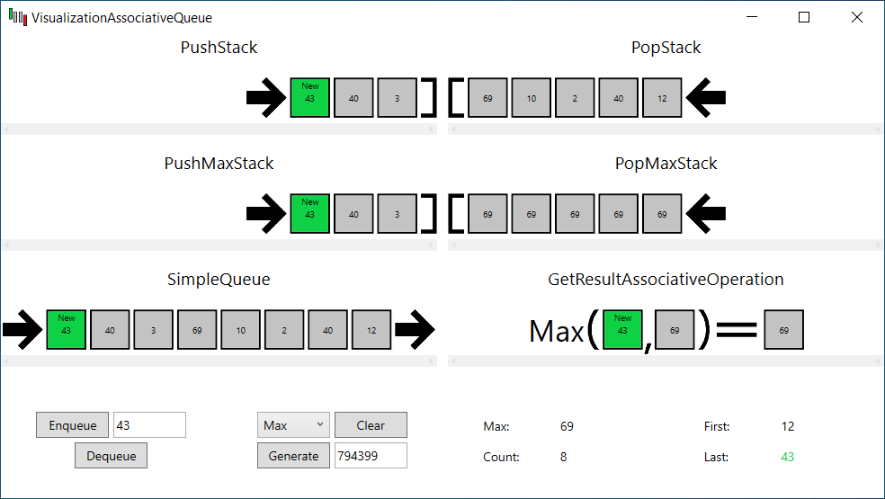
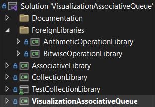

    
    <h1 align="center">VisualizationAssociativeQueue</h1>
    <h4 align="center">Визуализация ассоциативной очереди</h4>

## Об очереди

Обычная очередь имеет несколько реализаций, среди них существует [реализация на двух стеках](https://neerc.ifmo.ru/wiki/index.php?title=%D0%9E%D1%87%D0%B5%D1%80%D0%B5%D0%B4%D1%8C#.D0.A0.D0.B5.D0.B0.D0.BB.D0.B8.D0.B7.D0.B0.D1.86.D0.B8.D1.8F_.D0.BD.D0.B0_.D0.B4.D0.B2.D1.83.D1.85_.D1.81.D1.82.D0.B5.D0.BA.D0.B0.D1.85). Эти два стека обычно называют либо __LeftStack__ и __RightStack__, либо __PushStack__ и __PopStack__. Мы будем использовать второй вариант.

Данную реализацию можно модифицировать, добавив два дополнительных стека __PushAssociativeStack__ и __PopAssociativeStack__.

Значение __AssociativeStack[i]__ (i-ый элемент стека, где __AssociativeStack[0]__ - первый добавленый элемент) равняется __f(Stack[i], AssociativeStack[i - 1])__, где функция __f__ обладает свойством [ассоциативности](https://ru.wikipedia.org/wiki/%D0%90%D1%81%D1%81%D0%BE%D1%86%D0%B8%D0%B0%D1%82%D0%B8%D0%B2%D0%BD%D0%BE%D1%81%D1%82%D1%8C_(%D0%BC%D0%B0%D1%82%D0%B5%D0%BC%D0%B0%D1%82%D0%B8%D0%BA%D0%B0)). Первый элемент вычисляется как __AssociativeStack[0]__ = __Stack[0]__.

Таким образом, значение ассоциативной операции на множестве элементов очереди, то есть значение ассоциативной функции __f(Queue[0], Queue[1], ..., Queue[n - 1])__, будет равняться __f(PushAssociativePeek, PopAssociativePeek)__, где аргументами функции являются последние элементы ассоциативных стеков.

Итого, мы получаем очередь, которая умеет вычислять значение ассоциативной операции (например, нахождение максимума или минимума) на множестве элементов очереди за __O(1)__ при условии, что операция тоже совершается за константное время.

## Об приложении

Приложение предназначено для взаимодействия с ассоциативной очередью, содержащую неотрицательные числа.

Приложение написано на WPF'е в соответствии c паттерном MVVM.

    

### Проекты

    

* [VisualizationAssociativeQueue](VisualizationAssociativeQueue) - WPF-приложение, основной проект.
* [CollectionLibrary](CollectionLibrary) - библиотека коллекций, в ней реализованы ассоциативные и наблюдаемые (реализующие [INotifyCollectionChanged](https://learn.microsoft.com/ru-ru/dotnet/api/system.collections.specialized.inotifycollectionchanged?view=net-8.0)) стеки и очереди.
* [TestCollectionLibrary](TestCollectionLibrary) - юнит-тестирование библиотеки коллекций.
* [AssociativeLibrary](AssociativeLibrary) - библиотека, предоставляющая интерфейс IAssociativeOperation\<T>.
* ForeignLibraries - библиотеки классов, реализующие IAssociativeOperation\<int>.
  * [ArithmeticOperationLibrary](ArithmeticOperationLibrary) - библиотека арифметических операций.
  * [BitwiseOperationLibrary](BitwiseOperationLibrary) - библиотека побитовых операций.

### Интеграция ассоциативных операций

Основной проект заранее не знает об ForeignLibraries (в зависимостях они не указаны), поэтому они указаны как внешние. 

VisualizationAssociativeQueue получает ассоциативные операции благодаря [конфигу](VisualizationAssociativeQueue/Config.xml), в котором указаны пути до сборок, от которых ожидается содержание классов, реализующие интерфейс IAssociativeOperation\<int>.

Таким образом, сторонний разработчик может добавить в приложение свои ассоциативные операции, не имея доступа к исходникам самого приложения, указав в конфиге пути до своих сборок.